# horizon-physical-machines
App to quickly add Physical Machines into VMware Horizon Manual Pool

There is no direct support for this tool - it is provided as is.

Please provide any feedback directly to me - my contact information: 

Chris Halstead
chalstead@vmware.com
Twitter: @chrisdhalstead
March 15, 2020

Tons of thanks to Andrew Morgan @andyjmorgan for collaboration on this process.

#### Change Log

- 1.0 - March 15, 2020 
  - Initial Release
- 1.1 - March 16, 2020
  - Fixed an issue where the CSV contains the quote character - if found, remove it.
- 1.2 - March 16, 2020
  - Prevent a user from being assigned two machines in a pool
  - Fix some API queries that sometimes caused 400 errors
  - Other UI fixes

#### Overview

This app is used to quickly add physical machines that have a Horizon client installed and registered to a connection server to a manual pool and entitle the desktop and pool.   The app reads from a .csv file and checks to see if the specific machine is available and if so it adds it to the selected pool.  The app can be used to create a manual pool to use with unregistered machines.  

#### Features

- All connections to Horizon via REST 
- Certificate Validation
- Multi-threaded
- Logging and Error Trapping
- Manual Pool Creation
- Shows live progress
- View Pool Details

#### Pre-Requisites

- .NET Framework 4.6.1 or later
- Windows Operating System
- Horizon 7.7 or later (Official Horizon support added - prior versions may work just not supported)
- Admin Credentials to Horizon Connection Server

#### Usage

1. Download and Run `HorizonUnmanagedMachines.exe` from this repository

2. Enter the Horizon Connection Server FQDN and click Connect

   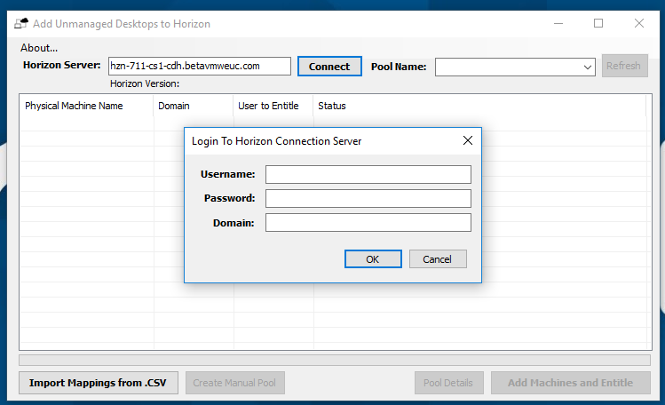

   

3. Enter Username, Password and Domain and Click OK - the first time you connect you will be asked to accept the certificate on the Horizon server

   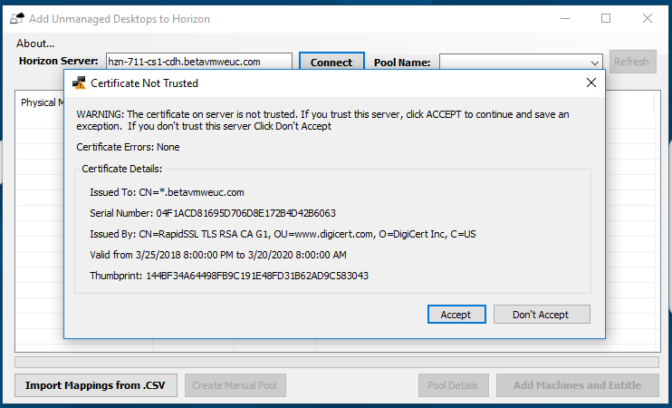

   

4. If you have no manual pools that are configured for unmanaged machines - you will see the following prompt:

   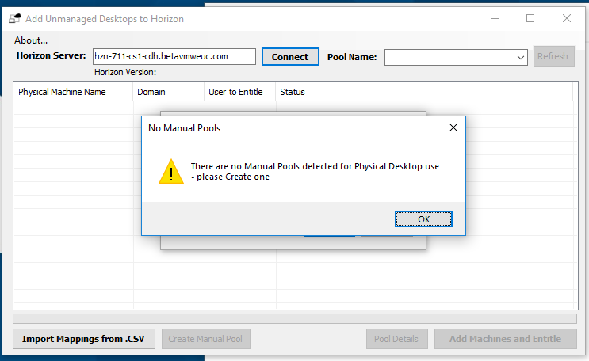

   

   The app will create a manual pool that is configured for use with unregistered machines.  Click OK to continue.
   

5. Enter a Pool Name, and optionally a display name.  This is what users will see if the Horizon Client.  If you leave it blank, users will see the name of the pool.  Select a default protocol (users will be able to change on the client), select an access group and choose if you would like HTML access and Session Collaboration (Blast only).   Click ok to create the pool.   Click OK twice to confirm pool creation and on the box to show the pool is complete.  

   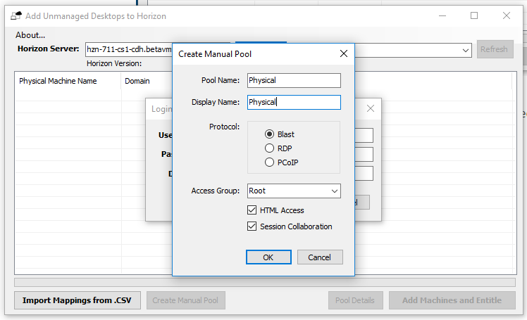

   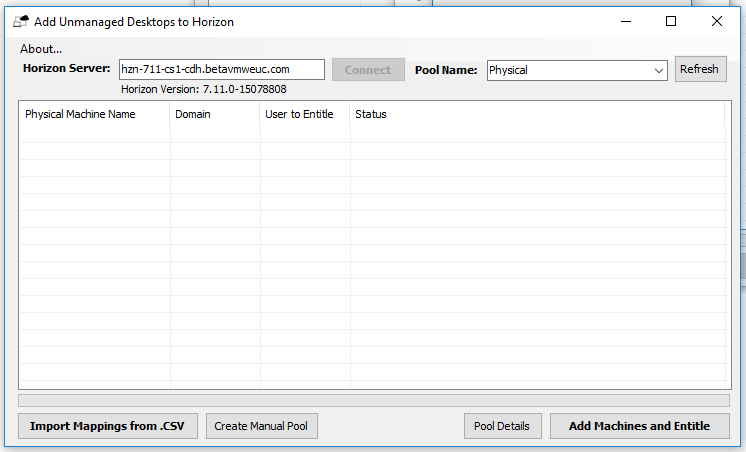

   You will now see the pool under Pool Name - this dropdown will show all manual pools that are configured for unmanaged machines

   In the Horizon Console, you can identify pools created by this tool by looking at the description.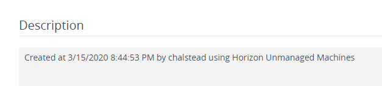

6. Create .CSV File 

   1. This file should contain physical devices which have been registered with the Horizon Connection Server (See More in "Installing Horizon Agent on Physical" below) and the user to associate with the desktop.  This user will have a direct entitlement added to the desktop and one added to the pool. the username must be formatted as domain\username.
   2. The format of the CSV file should be as follows:  
      1. Header Line:  Machine,User
      2. Data: mydesktop,domain\user

   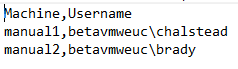Sample of CSV File

7. Import CSV file

   1. Click the "Import Mappings from .CSV button" - select the .CSV and click Open.  There are several validations that happen during the import process.  There is a maximum of 2000 items that can be imported at a time.  2000 is the maximum size of a pool in Horizon, so if you have more that 2000 devices to import them should be broken up into .csv files of less that 2000 each.

   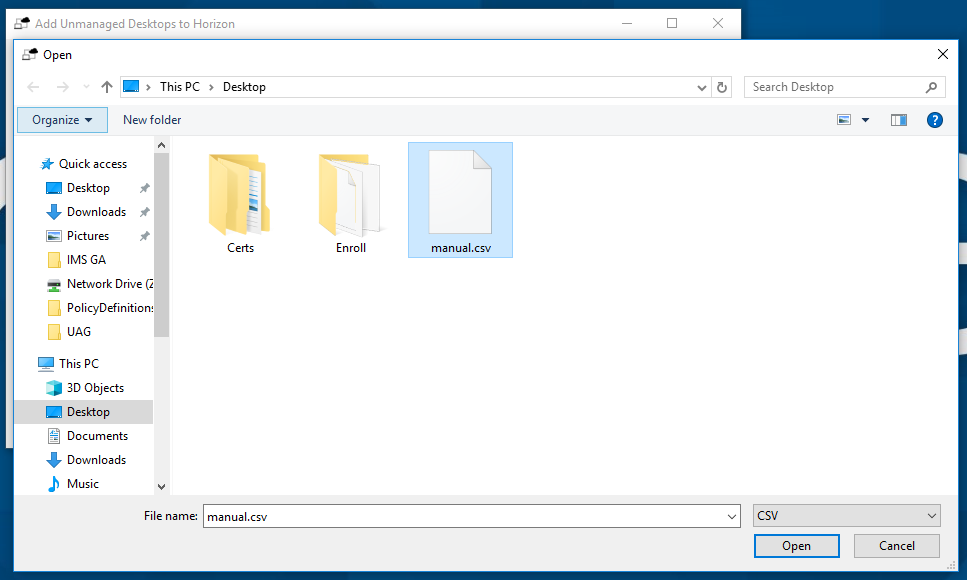

   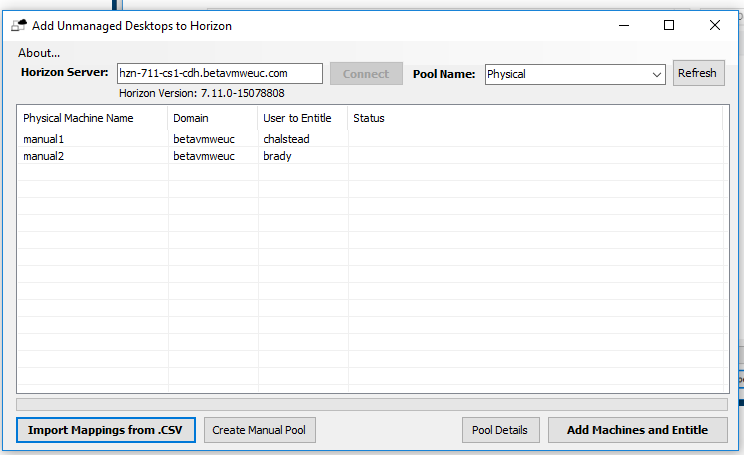

   

8. Once you have imported the data you are ready to add the machines to the selected pool and entitle them.  Click "Add Machines and Entitle".  Click yes on the message box to start the process.  The listview will be updated live as action are done in Horizon 

   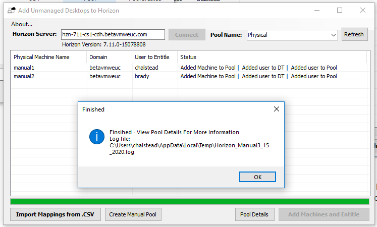

   You will see the success or failure of the following actions:

   *Adding Machine to Pool
   *Adding an entitlement for the user to the desktop
   *Adding an entitlement for the user to the pool	

9. The process is finished - you can view the log file to see exactly what happened.   It is called Horizon_Manual[date].log.  It is located in the %temp% directory.

   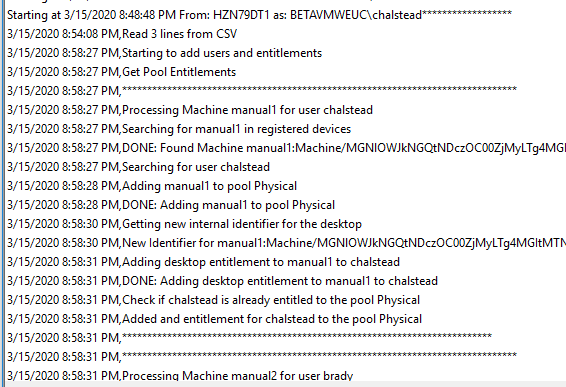

   

10. The actions can also be verified in the Horizon Console

    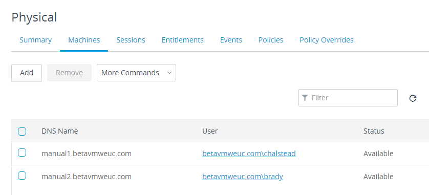

    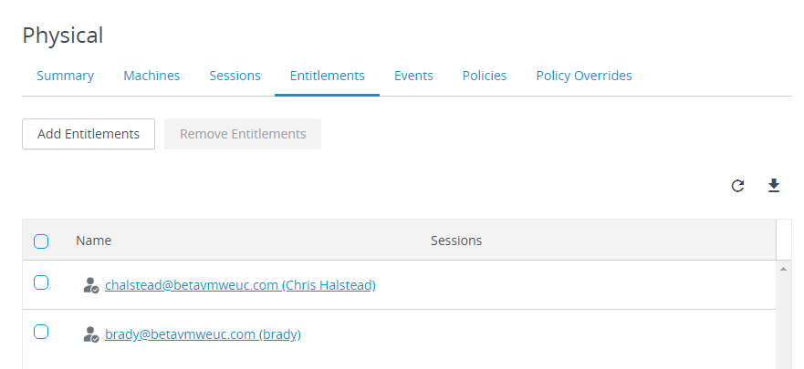

    

11. You can view Pool Details by clicking the Pool Details 

    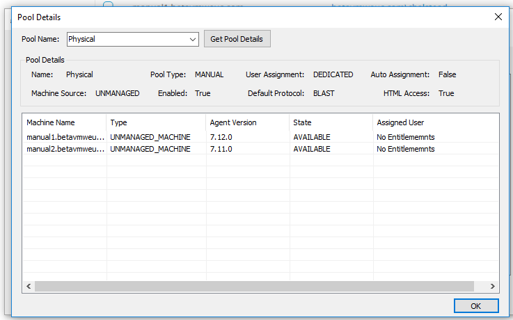

    

12. Additional manual pools can be created at any time by clicking the "Create Manual Pool" Button.

#### **Installing Horizon Agent on Physical**

You can use the [tool that Andrew Morgan developed](https://github.com/andyjmorgan/HorizonRemotePCHelperScripts) that installs the Agent and creates the .csv file that this utility needs or use any tool for distributing software such as SCCM.  This app will push the Horizon Agent and install it via PSRemoting and will adjust power policies.  It is in active development and he is adding wake on lan in a future release.  

Install string for installing the Horizon Agent as unmanaged and register to a connection server:

`VMware-Horizon-Agent-x86_64-7.12.0-15579917.exe /s /v” /qn VDM_VC_MANAGED_AGENT=0 VDM_SERVER_NAME=<connserver> VDM_SERVER_USERNAME=<domain\username> VDM_SERVER_PASSWORD=<pw>”`

#### Tips

- Windows 7 may work with the RDP protocol

#### Demo

Coming...